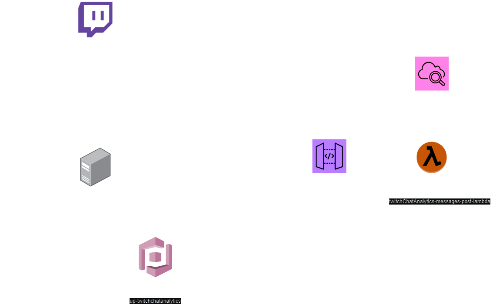

# Twitch Chat Bot with AWS Integration

## Description 
todo

## Architecture
Current status:


## Requirements
 - NPM 10.9.0
 - NPX 10.9.0
 - Node.js v20.11.0
 - Twitch account with bot privileges (see below how to get one)

## How to run
1. **Generate access token for your bot Twitch account** - described [below](#How-to-get-Twitch-account-with-bot-priviledges)
2. **Clone this repository**
   ```bash
   git clone https://github.com/barteknowak31l/TwitchChatAnalysis.git
   ```
3. **Install dependencies with:**
    ```bash
   npm install
   ```
4. **Configure environment variables with dotenvx**
   1. Request access to .env.keys file with `DOTENV_PRIVATE_KEY`
   2. Copy that file to root folder of the project
   3. Decrypt and change `.env` file if needed:
      ```bash
      npx dotenvx decrypt
      ```
      - set `TWITCH_BOT_OAUTH_TOKEN` to the access token you generated for bot account
      - set `BOT_USER_ID` to Channel Id of the account you generated access token for
      - set `CHAT_CHANNEL_USER_ID` to Channel Id of the broadcaster you want to listen to
      - both ids can be obtained [here](https://www.streamweasels.com/tools/convert-twitch-username-%20to-user-id/)
      - Encrypt again after making changes
      ```bash
      npx dotenvx encrypt
      ```
   4. **Never commit `.env.keys` or decrypted `.env` files!** <br></br>
5. **Run with** 
    ```bash
   DOTENV_PRIVATE_KEY={DOTENV_PRIVATE_KEY} dotenvx run -- node entryPoint.mjs
   ```

## How to get Twitch account with bot priviledges
You can use your own Twitch account or create a new one.
1. Login to your Twitch account.
2. Go to this [link](https://id.twitch.tv/oauth2/authorize?response_type=token&client_id=y3s6y3r4sxt83e3qc53jz5uqmun47g&redirect_uri=http%3A%2F%2Flocalhost&scope=user%3Abot%20user%3Aread%3Achat%20user%3Awrite%3Achat) and authorize
3. After successful authorization you will be redirected to `localhost` and your `access token` will be stored inside a query param
4. This token will persist for 60 days
5. Remember to set this access token in `.env` file as `TWITCH_BOT_OAUTH_TOKEN`


### Known todo's
 - Currently Cognito is configured with default email provided by AWS, which limits up to 50 operations per day (register/forgot password) - check if creating our own SES is worth doing

