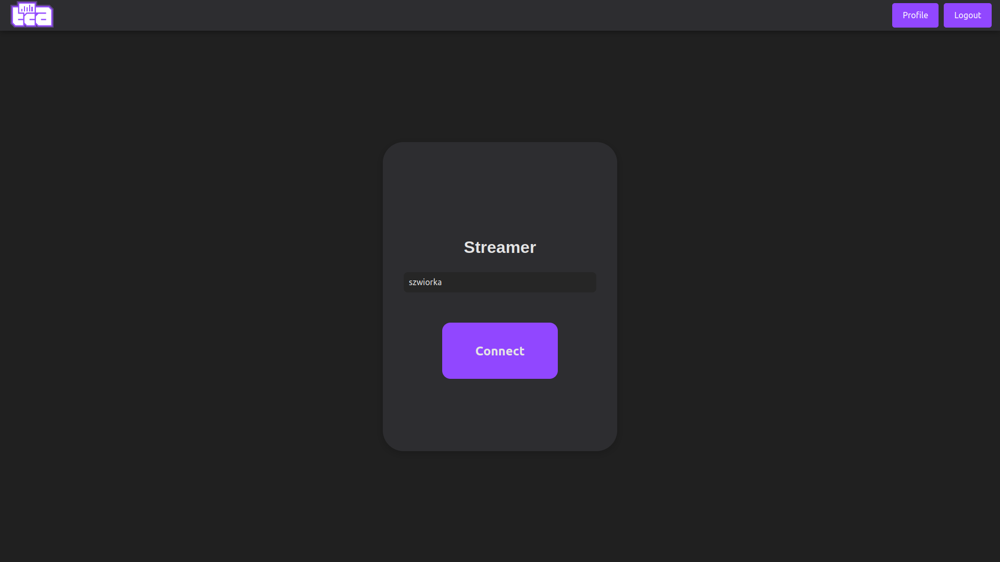
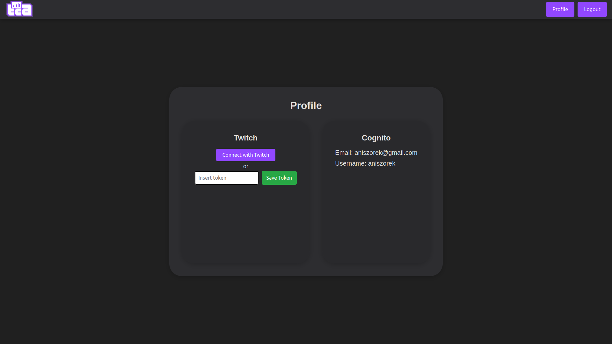
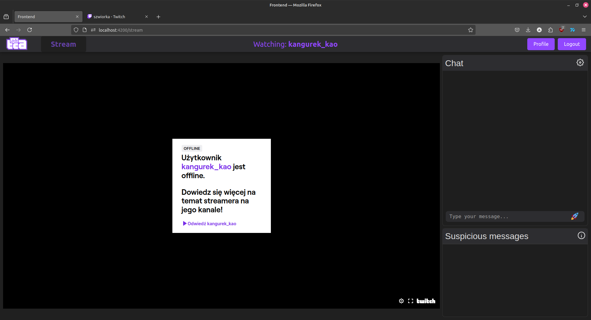
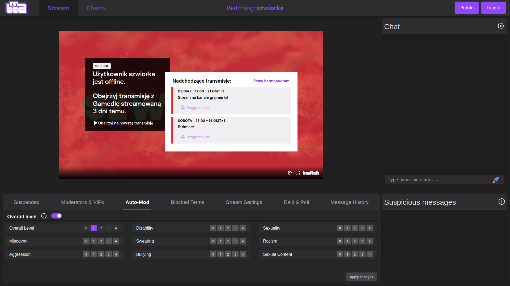
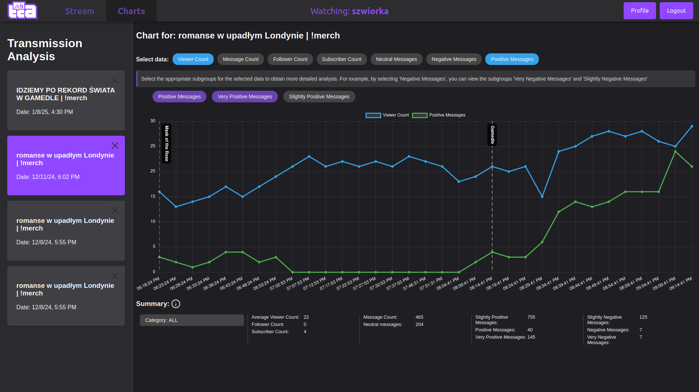

# Twitch Chat Analyzer - Web Application for Detecting and Classifying Negative Content on Twitch


search_streamer.png)

## Description

A comprehensive web application that leverages Natural Language Processing (NLP) and cloud computing to detect and classify negative content in Twitch chat. The application provides real-time sentiment analysis of chat messages and offers moderation tools integrated directly with Twitch's platform.

Key features:
- Real-time sentiment analysis of Twitch chat messages using Google Natural Language API
- Three-tier user roles (viewer, moderator, streamer) with different permission levels
- Complete Twitch moderation tools integration (ban, timeout, VIP management)
- Stream statistics and analytics with visual charts
- Suspicious message detection with color-coded severity levels
- Serverless architecture using AWS services (Lambda, Cognito, DynamoDB, RDS)

## Architecture

 <!-- Add architecture diagram here -->

The application consists of three main components:
1. **Local Server**: Node.js/Express.js backend handling WebSocket connections and API calls
2. **Frontend**: Angular-based user interface
3. **Cloud Components**: AWS services (Cognito, Lambda, DynamoDB, RDS) and Google NLP API

Data flow:
1. Messages from Twitch chat are received via EventSub
2. Sent for sentiment analysis to Google NLP API
3. Results stored in AWS RDS PostgreSQL database
4. Negative messages flagged in real-time to moderators
5. Stream statistics aggregated and visualized

## Requirements

- NPM 10.9.0
- NPX 10.9.0
- Node.js v20.11.0
- Angular CLI
- Registered Twitch Application (get one [here](https://dev.twitch.tv/console/apps/create))
- AWS account (for Cognito, Lambda, DynamoDB, RDS)
- Google Cloud account (for Natural Language API)

## How to run
1.**Clone this repository**
   ```bash
   git clone https://github.com/aniszorek/TwitchChatAnalysis.git
   ```
2.**Install backend dependencies and run with:**
```bash
   cd backend
   npm install
   npm start
   ```

3.**Install dependencies and run frontend application**
```bash
   cd frontend
   npm install
   ng serve
```
   
   
4.**Configure environment variables with dotenvx**
   1. Create a .env file and set there env variable as follows:
      ```bash
      TWITCH_APP_CLIENT_ID="YOUR_APP_CLIENT_ID"
`     
   2. Copy that file to root folder of the backend project
      - set `TWITCH_APP_CLIENT_ID` to the client id of your application
      - Encrypt again after making changes
      ```bash
      npx dotenvx encrypt
      ```
## Features Overview

### User Roles


- **Streamer**: Full access to all moderation tools and analytics
- **Moderator**: Access to chat moderation tools
- **Viewer**: Basic chat viewing with sentiment indicators

### Moderation Tools


- Real-time message analysis
- Ban/timeout users
- Manage moderators/VIPs
- Configure Auto-Mod settings
- Block specific terms
- Message history review

### Analytics Dashboard


- Viewer count trends
- Message sentiment analysis
- Follower/subscriber growth
- Category performance
- Historical data comparison

## Technical Implementation Details

### Backend Services
- **Authentication**: AWS Cognito with JWT tokens
- **Database**: AWS RDS with PostgreSQL
- **Serverless Functions**: AWS Lambda for message processing
- **Real-time Communication**: WebSocket API Gateway
- **Message Queueing**: Amazon SQS for reliable message processing

### Frontend Components
- Angular framework with TypeScript
- Responsive UI with multiple views:
      - Stream view with integrated chat
      - Suspicious messages panel
      - Moderation tools
      - Analytics dashboard

## Contributors

- **Anna Ogorzalek** - Frontend development, AWS management, authorization system
- **Bartosz Nowak** - Backend architecture, AWS Lambda functions, WebSocket implementation
- **Dawid Nowakowski** - Twitch API integration, user management interfaces
- **Hubert Sulżycki** - Database design, Google NLP integration, UI design