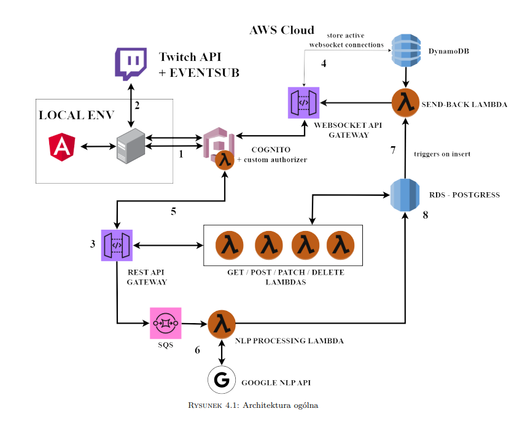

# Twitch Chat Bot with AWS Integration

## Description 
Web application to detect and classify negative content in Twitch.


## Architecture


## Requirements
 - NPM 10.9.0
 - NPX 10.9.0
 - Node.js v20.11.0
 - registered Twitch Application (get one here https://dev.twitch.tv/console/apps/create)

## How to run
1.**Clone this repository**
   ```bash
   git clone https://github.com/barteknowak31l/TwitchChatAnalysis.git
   ```
2.**Install backend dependencies and run with:**
```bash
   cd backend
   npm install
   npm start
   ```

3.**Install dependencies and run frontend application**
```bash
   cd frontend
   npm install
   ng serve
```
   
   
4.**Configure environment variables with dotenvx**
   1. Create a .env file and set there env variable as follows:
      ```bash
      TWITCH_APP_CLIENT_ID="YOUR_APP_CLIENT_ID"
`     ```
   2. Copy that file to root folder of the backend project
      - set `TWITCH_APP_CLIENT_ID` to the client id of your application
      - Encrypt again after making changes
      ```bash
      npx dotenvx encrypt
      ```

